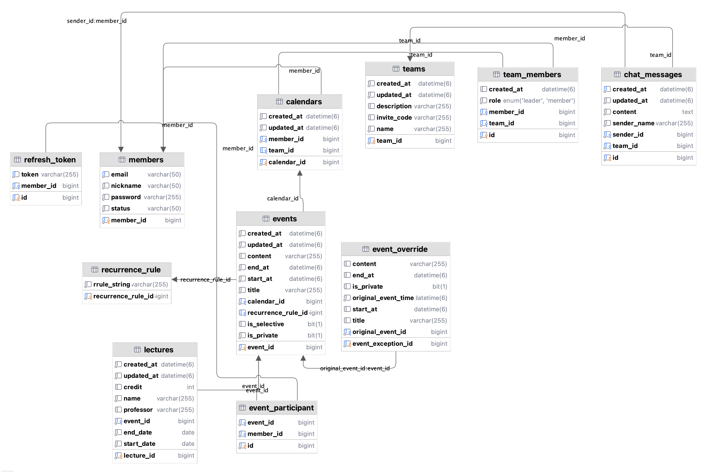
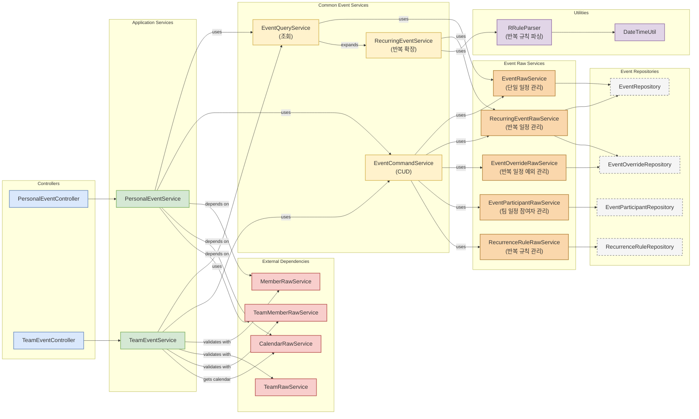
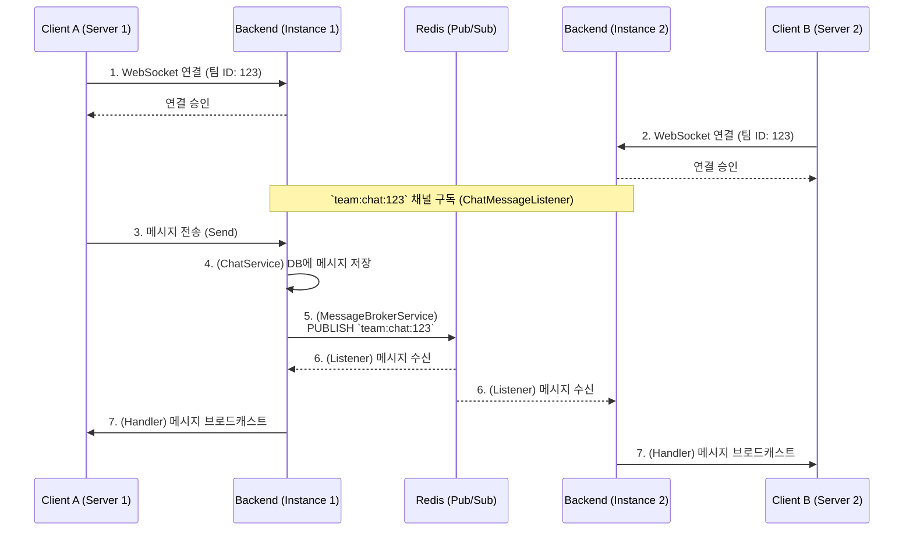

# UniSchedule (BE)

대학생들의 복잡한 팀 프로젝트와 개인 일정을 한 번에 관리해주는 대학생 맞춤형 일정 관리 서비스입니다. 조별 과제, 동아리, 스터디 등 팀 활동에 최적화된 기능을 제공하여 일정 조율의 효율을 높이고 커뮤니케이션 비용을 절감하는 것을 목표로 합니다.

### 1. 프로젝트 배경

#### 1.1. 국내외 시장 현황 및 문제점

- 기존 캘린더 서비스의 한계
    - Google 캘린더 
        - 팀원 간의 실질적인 공통 가용 시간을 파악하기 위해 복잡한 공유 설정이 필요합니다. 특히, 팀 공유 기능은 유료 Workspace 구독이 필요해 접근성이 낮습니다.
    - When2Meet 등 일회성 일정 조율 도구
        - 일회성 조율 조구는 지속적인 일정 관리가 어렵고 캘린더 기능이 부족합니다.

#### 1.2. 필요성과 기대효과

대학생들에게 비용 부담이 낮고 접근성이 좋으며, 지속적인 일정 관리가 가능한 맞춤형 서비스가 필요합니다.

본 서비스에서는 개인 캘린더 및 팀 캘린더 기능을 함께 제공하고, 에브리타임 시간표 및 Google 캘린더 연동을 지원해서 일정 관리 편의성을 높였습니다.

팀원들의 가용 시간을 자동으로 분석하고 최적의 회의 시간을 추천함으로써, 일정 조율에 필요한 커뮤니케이션 비용을 크게 줄일 수 있을 것으로 기대합니다.

### 2. 개발 목표

#### 2.1. 목표 및 세부 내용

> 목표

- 개인 일정과 팀 일정을 통합 관리하는 캘린더 서비스 구축
- 팀원 간 가용 시간 조회를 통한 최적 일정 추천 기능 제공
- 개인 일정 내용 노출 방지(사생활 보호)
- 에브리타임, Google 캘린더 등 외부 일정 연동 기능 제공

> 세부 구현 내용

1. 유연한 일정 관리 옵션
    - 일정 CRUD (단일 일정/반복 일정) 기능
    - 개인/팀 일정 및 단일/반복 일정 계층화 및 분리
    - iCal4j 라이브러리를 활용한 iCalendar(RFC 5545) 표준 RRULE 기반 반복 일정 처리
    - 반복 규칙, 특정 날짜 예외, 팀 일정 참여자 선택 등 상세 옵션 제공

2. 외부 일정 연동 기능
    - 에브리타임 시간표 연동 (WebClient 및 OpenAI 이미지 분석)
    - Google 캘린더 일정 동기화(OAuth2)

3. 직관적인 팀원 일정 공유
    - 초대 코드 기반 팀 생성 및 가입
    - 팀 일정 생성 시, 팀원 캘린더에 일정 자동 반영
    - 팀 가용 일정 조회 기능
    - 팀원 전체 참여 가능 시간대 추천
    - WebSocket 및 Redis 기반 실시간 팀 채팅 기능


#### 2.2. 기존 서비스 대비 차별성

| 주요 기능 | Google Calendar | When2Meet | Notion | UniSchedule |
| :--- | :--- | :--- | :--- | :--- |
| 수업 일정 등록 | 매 학기 수동 등록 | 기능 없음 | 수동 등록 | 에브리타임 연동 |
| 팀원 일정 확인 | 모든 캘린더 공유/초대 필요 | 가능한 시간 투표 | 구글 캘린더 공유 필요 | 팀 생성/참여 및<br>팀원 가용 시간 확인 가능 |
| 프라이버시 | 일정 공개 여부 선택 가능 | 익명 투표 | 일정 공개 여부 선택 불가능 | 시간만 공유 |
| 팀 일정 등록 | 유료 Workspace 사용 필요 | 미제공 | 구글 캘린더 의존 | 팀 내 메신저 및<br>팀 일정 등록 가능 |

### 3. 시스템 설계

#### 3.1. 시스템 구성도

본 프로젝트의 백엔드는 AWS(Amazon Web Services) 기반의 컨테이너 오케스트레이션 환경에 배포됩니다. Terraform을 사용해서 모든 인프라를 코드(IaC)로 관리하며, GitHub Actions를 통해 CI/CD 파이프라인을 자동화했습니다.

  * **CI/CD (DevOps)**

    1.  개발자가 `main` 또는 `develop` 브랜치에 Push하면 **GitHub Actions**가 실행됩니다.
    2.  Spring Boot 애플리케이션을 Gradle로 빌드하고 Docker 이미지를 생성합니다.
    3.  생성된 이미지를 **AWS ECR** (Elastic Container Registry)에 Push합니다.
    4.  **Terraform**이 ECR 이미지 태그 변수를 받아, \*\*AWS ECS (Fargate)\*\*의 Task Definition을 업데이트하여 애플리케이션을 무중단 배포합니다.

  * **Backend Infrastructure**

      * **Network**: **AWS VPC** 내에 Public Subnet을 구성하고, **ALB** (Application Load Balancer)를 통해 트래픽을 분산합니다. **Route53**와 **ACM**을 통해 `*.uni-schedule.com` 도메인 및 HTTPS(SSL)를 적용합니다.
      * **Application Server**: Java 21, Spring Boot 3.5.5로 구현된 메인 서버가 \*\*AWS ECS (Fargate)\*\*에서 컨테이너로 실행됩니다.
      * **Database**: \*\*AWS RDS (MySQL)\*\*를 사용하여 데이터를 저장합니다.
      * **Cache & Pub/Sub**: **Redis**를 사용하여 실시간 채팅 메시지 브로드캐스팅(Pub/Sub) 및 이메일 인증 코드(Cache)를 관리합니다.
      * **Configuration**: DB 접속 정보, JWT Secret 등 민감한 정보는 **AWS SSM Parameter Store**에 안전하게 저장하고, 애플리케이션 실행 시 주입받습니다.

#### 3.2. 사용 기술 (Backend & DevOps)

| 구분 | 기술 스택 | 비고 (관련 파일) |
| :--- | :--- | :--- |
| **Back-end** | Java 21 | `backend/build.gradle` |
| | Spring Boot 3.5.5 | `backend/build.gradle` |
| | Spring Security | `backend/src/main/java/unischedule/common/config/SecurityConfig.java` |
| | JWT (JSON Web Token) | `backend/src/main/java/unischedule/auth/jwt/JwtTokenProvider.java` |
| | JPA / Hibernate | `backend/build.gradle` |
| **Async** | Spring WebSocket | `backend/src/main/java/unischedule/common/config/WebSocketConfig.java` |
| | Spring WebFlux (WebClient) | `backend/src/main/java/unischedule/common/config/WebClientConfig.java` |
| **Database** | MySQL (AWS RDS) | `infra/rds.tf` |
| **Cache/PubSub** | Redis | `backend/src/main/java/unischedule/common/config/RedisConfig.java` |
| **External API** | ical4j (RRule) | `backend/src/main/java/unischedule/events/util/RRuleParser.java` |
| | Google Calendar API (OAuth2) | `backend/src/main/java/unischedule/google/service/GoogleCalendarService.java` |
| | OpenAI API | `backend/src/main/java/unischedule/external/OpenAiClient.java` |
| | Everytime API | `backend/src/main/java/unischedule/external/EverytimeClient.java` |
| **DevOps** | Terraform (IaC) | `infra/` |
| | Docker | `backend/Dockerfile` |
| | GitHub Actions (CI/CD) | `.github/workflows/ci.yml` |
| **Cloud** | AWS (ECS, ECR, RDS, S3, ALB, Route53, VPC) | `infra/` |

#### 3.3. ERD 다이어그램



### 4\. 개발 결과

#### 4.1. 핵심 기능 흐름도

**1. 일정 관리 구조**



**2. 실시간 팀 채팅 (WebSocket & Redis Pub/Sub)**



#### 4.2. 디렉토리 구조 (Backend)

```
backend
├── .github/workflows
│   └── ci.yml              # CI/CD 파이프라인 (ECR, ECS 배포)
├── infra/                  # Terraform 인프라 코드 (IaC)
│   ├── ecs.tf              # ECS Fargate, ALB, Task Definition
│   ├── rds.tf              # RDS MySQL DB
│   ├── vpc.tf              # VPC, Subnet, IGW
│   ├── ecr.tf              # ECR 저장소
│   ├── ssm.tf              # SSM Parameter Store (환경 변수)
│   ├── security_groups.tf  # 보안 그룹
│   └── ...
├── build.gradle            # 프로젝트 의존성 관리 (Spring, Java 21)
├── Dockerfile              # 백엔드 서버 Docker 이미지 빌드
└── src/main
    ├── java/unischedule
    │   ├── auth/           # 인증 (JWT, OAuth2, Email)
    │   ├── calendar/       # 캘린더 도메인, 리포지토리, 서비스
    │   ├── common/         # 공통 설정 (SecurityConfig, RedisConfig, JpaAuditing)
    │   ├── events/         # 일정 도메인, 컨트롤러, 서비스, 리포지토리
    │   ├── exception/      # 전역 예외 처리 (GlobalExceptionHandler)
    │   ├── external/       # 외부 API 클라이언트 (EverytimeClient, OpenAiClient)
    │   ├── google/         # Google 캘린더 연동 서비스
    │   ├── lecture/        # 강의(시간표) 도메인, 컨트롤러, 서비스
    │   ├── member/         # 회원 도메인, 컨트롤러, 서비스
    │   └── team/           # 팀 기능
    │       ├── chat/       #   - 실시간 채팅 (WebSocket, Redis)
    │       ├── domain/     #   - 팀, 팀멤버, WhenToMeet 도메인
    │       ├── service/    #   - TeamService, WhenToMeet 서비스
    │       └── ...
    └── resources
        └── application.properties # 환경 변수 주입
```

### 5\. 설치 및 실행 방법

#### 5.1. 설치절차 및 실행 방법

> **사전 요구사항**: Java 21, Gradle, Docker, Redis, MySQL

1.  **Git Clone**

    ```bash
    git clone https://github.com/kakao-tech-campus-3rd-step3/team12_be.git
    cd backend
    ```

2.  **환경 변수 설정**
    `backend/src/main/resources/` 경로에 `.env` 파일을 생성하고, `application.properties` 및 `infra/ssm.tf`에 정의된 환경 변수를 입력합니다.

> **backend/src/main/resources/.env**

```properties
# JWT
JWT_SECRET=...
JWT_ACCESS_TOKEN_TIMEOUT_SEC=...
JWT_REFRESH_TOKEN_TIMEOUT_SEC=...

# Database (MySQL)
SPRING_DATASOURCE_URL=...
SPRING_DATASOURCE_USERNAME=...
SPRING_DATASOURCE_PASSWORD=...

# Redis
REDIS_HOST=...
REDIS_PORT=...
REDIS_USERNAME=...
REDIS_PASSWORD=...

# Google OAuth
GOOGLE_CLIENT_ID=...
GOOGLE_CLIENT_SECRET=...
GOOGLE_REDIRECT_URI=...

# Mail (Gmail SMTP)
MAIL_USERNAME=...
MAIL_PASSWORD=...

# External APIs
OPENAI_API_KEY=...
```

3.  **애플리케이션 실행 (Local)**
    로컬에 Redis, MySQL이 실행 중이어야 합니다.

```bash
./gradlew bootRun
```
